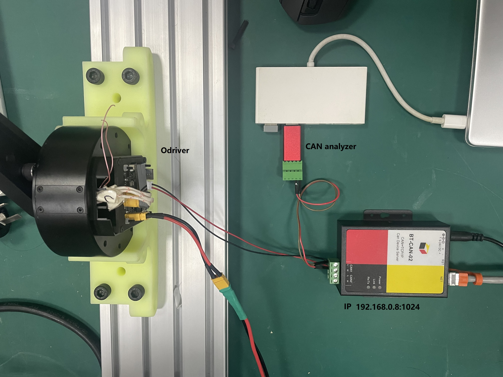

## 1. Overview
Under the ubuntu system using ethernet(UDP) to can module to control the Odrive drivers.The command control of position loop, speed loop and current loop and the feedback of angle, speed and current can be realized.

--- 
## 2. Hardware
**RMD-X8pro motor**;
**odrive 0.5.1**
**BT-CAN-02 from [vbobtdata](http://www.vbobtdata.com/)**

---

## 3. Control module
|Control mode | Feedback |
| ----        | ----     |
|*position loop* | position |
|*velocity loop*| velocity |
|*torque loop*| current |

---

## 4. Wiring diagram

<!--  -->
---

## 5. function 
* **"motor.h"**       : organize can message according to the protocol
* **"motor_msgs.h"**  : structure of command and callback
* **"SocketTool.h"**  : class for UDP and TCP communication
* **"can.h"**         : call the UDP interface to transmit msgs.

